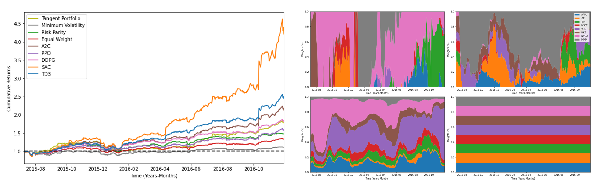

# Asset Allocation: From Markowitz to Deep Reinforcement Learning


[**Thesis**](http://hdl.handle.net/10609/146811) | [**Paper**](https://papers.ssrn.com/sol3/papers.cfm?abstract_id=4148379)

PyTorch implementation of **Asset Allocation: From Markowitz to Deep Reinforcement Learning**.

<p align="left"></p>

## Overview

Asset allocation is an investment strategy that aims to balance risk and reward by constantly redistributing the portfolio's assets according to certain goals, risk tolerance, and investment horizon. Unfortunately, there is no simple formula that can find the right allocation for every individual. As a result, investors may use different asset allocations' strategy to try to fulfill their financial objectives. In this work, we conduct an extensive benchmark study to determine the efficacy and reliability of a number of optimization techniques. In particular, we focus on traditional approaches based on Modern Portfolio Theory, and on machine-learning approaches based on deep reinforcement learning. We assess the model's performance under different market tendency, i.e., both bullish and bearish markets.

<p align="left"></p>

## Code
The repository contains two files:
 <ul>
  <li> DeepRL.py -> The reincorcement environment for asset allocation and its fucntions</li>
  <li> main.ipnyb -> The Jupyter notebook</li>
</ul> 

To use the code, we only need to run the `main.ipnyb` notebook. Note that you might need to installl thrid party libraries such as [stable_baselines3](https://stable-baselines3.readthedocs.io/en/master/), [pandas_datareader](https://pandas-datareader.readthedocs.io/en/latest/) and [pyfolio](https://github.com/quantopian/pyfolio).

## Acknowledgement
We acknowledge the official code [FinRL](https://github.com/AI4Finance-Foundation/FinRL) & [Stock-Trading-Environment](https://github.com/notadamking/Stock-Trading-Environment)

## Citation
```
@article{durall2022asset,
  title={Asset Allocation: From Markowitz to Deep Reinforcement Learning},
  author={Durall, Ricard},
  journal={Available at SSRN 4148379},
  year={2022}
}
```
